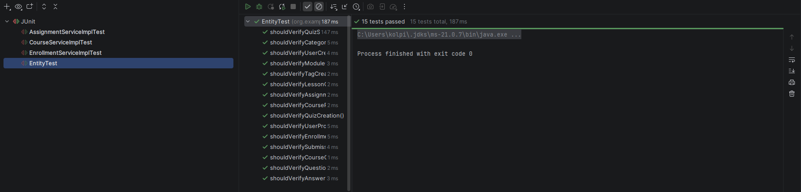
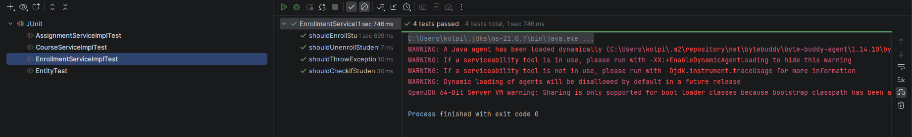

# Project Name

## Description
Learning platform for an online course on ORM and Hibernate.

## Tech Stack
- Java
- Spring Boot
- Spring Data JPA
- PostgreSQL
- Maven

## Requirements
- JDK 17+
- Maven 3.9+
- PostgreSQL (optional / H2 for local)

## Run locally
```bash
mvn clean spring-boot:run
```
## API Endpoints

**Base URL:** `/api`

---

## Assignment API

**Base path:** `/api/assignment`

### Assignments

- `POST /assignment`  
  Create assignment  
  **Body:** `AssignmentDto`
- `GET /assignment/{id}`  
  Get assignment by id
- `GET /assignment/lesson/{lessonId}`  
  Get assignments by lesson
- `GET /assignment/course/{courseId}`  
  Get assignments by course

### Submissions

- `POST /assignment/{assignmentId}/submit`  
  Submit assignment  
  **Params:** `studentId`, `content`
- `PUT /assignment/submissions/{submissionId}/grade`  
  Grade submission  
  **Params:** `score`, `feedback` (optional)
- `GET /assignment/{assignmentId}/submissions`  
  Get submissions by assignment
- `GET /assignment/submissions/student/{studentId}`  
  Get submissions by student

---

## Course API

**Base path:** `/api/course`

### Courses

- `POST /course`  
  Create course  
  **Body:** `CourseDto`
- `GET /course/{id}`  
  Get course by id
- `GET /course/{id}/with-modules`  
  Get course with modules
- `GET /course`  
  Get all courses
- `GET /course/category/{categoryId}`  
  Get courses by category
- `GET /course/teacher/{teacherId}`  
  Get courses by teacher
- `PUT /course/{id}`  
  Update course  
  **Params:** `title`, `description`
- `DELETE /course/{id}`  
  Delete course

### Modules

- `POST /course/{courseId}/modules`  
  Add module to course  
  **Params:** `title`, `orderIndex`
- `GET /course/{courseId}/modules`  
  Get course modules

### Tags

- `POST /course/{courseId}/tags/{tagId}`  
  Add tag to course

---

## Enrollment API

**Base path:** `/api/enrollment`

### Enrollments

- `POST /enrollment`  
  Enroll student  
  **Body:** `EnrollmentDto`
- `DELETE /enrollment`  
  Unenroll student  
  **Params:** `courseId`, `studentId`
- `GET /enrollment/student/{studentId}`  
  Get student enrollments
- `GET /enrollment/course/{courseId}`  
  Get course enrollments
- `GET /enrollment/student/{studentId}/courses`  
  Get courses for student
- `GET /enrollment/check`  
  Check if student is enrolled  
  **Params:** `courseId`, `studentId`  
  **Response:** `boolean`

---

## Quiz API

**Base path:** `/api/quiz`

### Quizzes

- `POST /quiz`  
  Create quiz  
  **Body:** `QuizDto`
- `GET /quiz/module/{courseModuleId}`  
  Get quiz by module

### Questions & Options

- `POST /quiz/{quizId}/questions`  
  Add question to quiz  
  **Params:** `text`, `type`
- `POST /quiz/questions/{questionId}/options`  
  Add answer option  
  **Params:** `text`, `isCorrect`

### Taking quiz

- `POST /quiz/{quizId}/take`  
  Take quiz  
  **Params:** `studentId`  
  **Body:** `Map<Long, Long>` (questionId → answerOptionId)

### Quiz submissions

- `GET /quiz/{quizId}/submissions`  
  Get quiz submissions
- `GET /quiz/submissions/student/{studentId}`  
  Get student quiz submissions

## How to Test

### Run automated tests
```bash
mvn test
```



